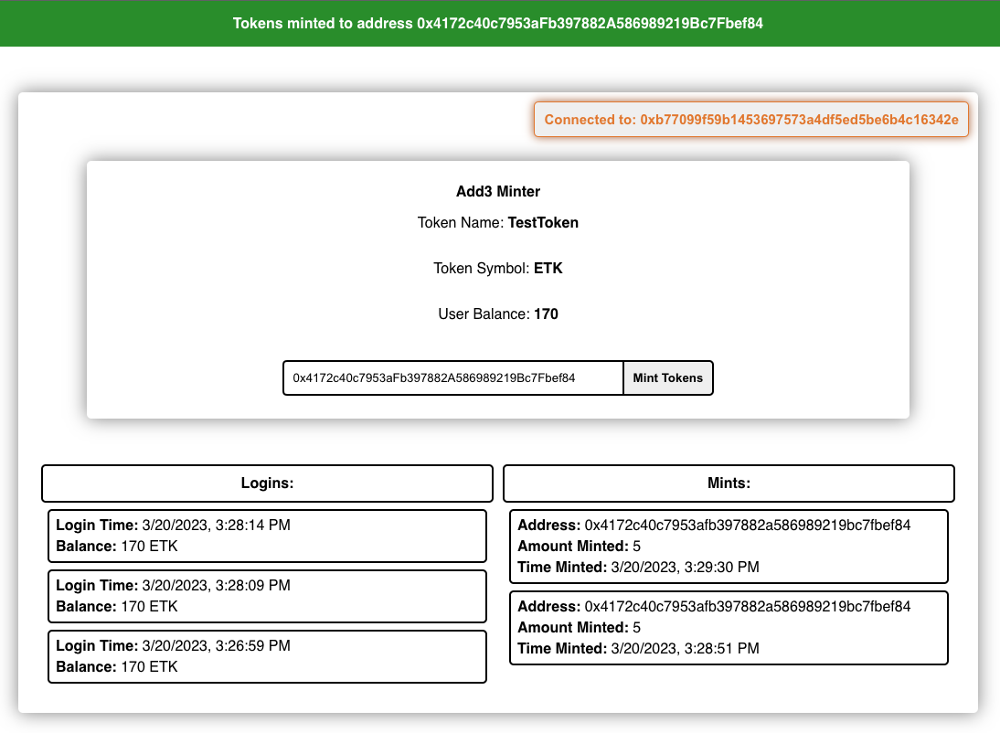

# Add3 Project

This project implements an ERC20 Token minting Dapp using React, TypeScript, Ethers.js, and MongoDb:

* Will allow a user to connect to the Dapp via MetaMask login
* When a user connects a new account or switches his account a new login will be posted to the MongoDb database
* Will allow a user to mint a TestToken to another account and will display a list of all mints
* Will alert a user when a mint transaction he initiated is completed

Front-end is located in `./frontend`<br>
Back-end is located in `./backend`<br>

Please add the below variables to your .env inside of `./frontend`

`REACT_APP_ALCHEMY_RPC_URL`<br>
`REACT_APP_API_SERVER_URL`<br>
`REACT_APP_TEST_TOKEN_ADDRESS`

To run the project in Docker run:
```shell
docker compose up
```

### Front-End View - Pre-Login

### Front-End View - Logged In

### Front-End View - Mint Alert

